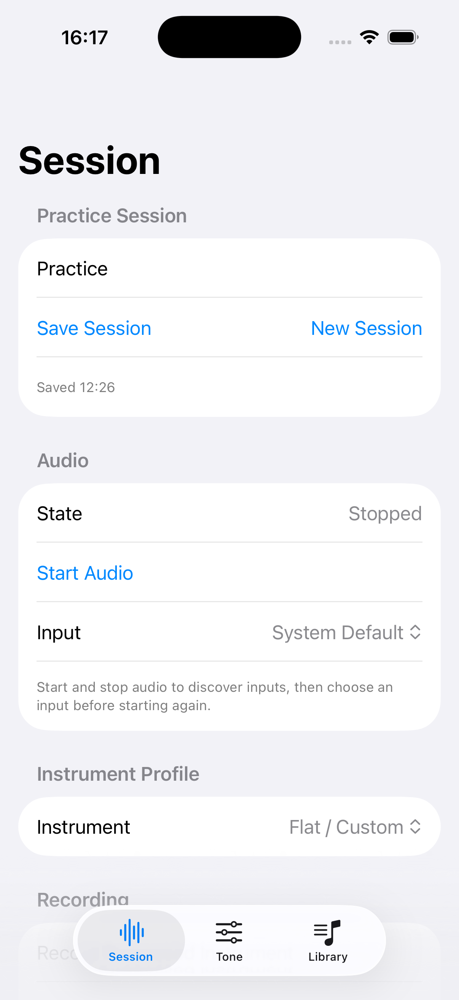
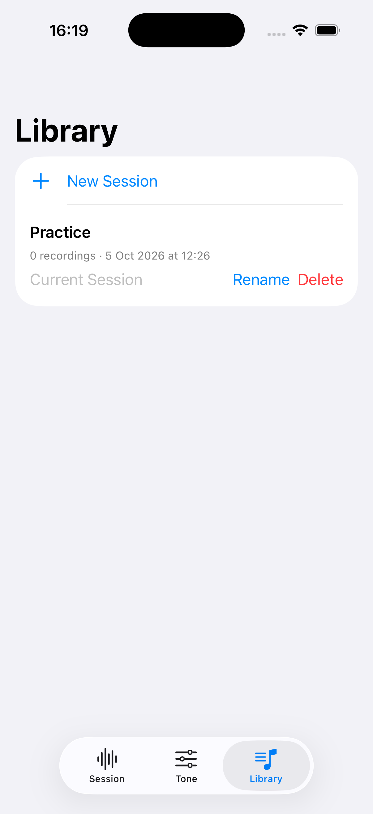

# Evidência e limites

Data: 5 de outubro de 2026. HEAD `e5a2532fcf38e9f45872f639078cba03192056d2`; fontes da app sem alteração. Checkout destacado, origem informada `codex/session-library`. Projeto de assinatura e scheme de testes locais preexistentes preservados. Nenhuma nova feature, merge, commit ou instalação no aparelho físico.

## Testes

- XcodeBuildMCP disponível e usado, scheme `BassPractice`, uma execução completa `test_sim` com `-quiet`.
- Resultado: **128 testes lógicos / 246 casos expandidos aprovados; 0 falhas, 0 skips**. Contagem expandida conferida com `xcresulttool get test-results summary`; o inventário inicial do MCP diz 119 e não é a contagem executada.
- Duração total informada pelo MCP: 167,5 s.
- Simulador retido: iPhone 17 Pro, iOS 26.2, UDID `34AA36AD-2704-4759-A347-01A023DEB371`.
- DerivedData: `/tmp/BassyUXValidation`.
- Resultado: `/Users/dmh/Library/Developer/XcodeBuildMCP/workspaces/ios-bass-app-568e1d72ee9d/result-bundles/test_sim_2026-10-05T19-11-05-236Z_pid57734_6b57b88b.xcresult`.
- Log: `/Users/dmh/Library/Developer/XcodeBuildMCP/workspaces/ios-bass-app-568e1d72ee9d/logs/test_sim_2026-10-05T19-11-05-235Z_pid57734_e8b09449.log`.

Entre os testes aprovados: CAF mono/estéreo com amostras conhecidas, `nativePlaybackRendersCAF` pelo player/mixer/ganho reais em rendering offline, geração de completion, finalização por stop/interrupção, mixer independente e restauração/persistência de sessão. Os demais backends simulados validam contratos, não hardware.

## Capturas reais

O `simctl` restrito não conseguiu conectar ao CoreSimulatorService. MCP boot e host `bootstatus -b` confirmaram a conclusão do boot. App instalada a partir do produto já testado, sem rebuild. O primeiro pedido MCP de launch foi rejeitado por falta de `bundleId` nos defaults, antes de executar; default corrigido e launch confirmado. Capturas via `simctl` com acesso ao host, checker do repositório aprovado e inspeção visual de cada imagem.

Session mostra Stopped e Record abaixo da área inicial. Confirma a dificuldade de acesso visual; não comprova gravação, reprodução ou som.

Library mostra a sessão Practice e sua contagem de gravações. O argumento passado ao MCP não selecionou a aba na primeira tentativa; a captura incorreta foi substituída após lançamento explícito com `simctl launch … -initial-tab library`, conferência do checker e inspeção visual. Abrir/renomear/excluir não foram exercitados por taps. A sessão do simulador não é a sessão do relato no iPhone.

## Protótipo

Fluxos locais no navegador conferidos: Gravar → Finalizar → Ouvir muda o botão para Parar; abrir Entrada e saída e ligar mute mostra aviso de reprodução sem volume; segunda variante renderiza. Estados e duração são simulados. Essa verificação não representa interação com a app nativa. Arquivo de apresentação da conversa: `/Users/dmh/.codex/visualizations/2026/10/05/01a10d79-1866-7b53-b7e8-ff79159a6398/bassy-fluxos.html`.

## Pendências físicas

Não foi analisado o CAF do relato nem observada a rota/volume real do aparelho. Não há validação auditiva em speaker, receiver, fones ou interface. Taps de gravação/playback da app nativa, estados ativos e persistência pelo fluxo físico permanecem pendentes. Ver matriz controlada em [PROPOSTA.md](PROPOSTA.md).

Decisão humana sugerida: escolher “Prática e gravações” como direção de navegação. Isso não aprova a causa do defeito de áudio nem libera novas features V0.1 antes do teste físico.
