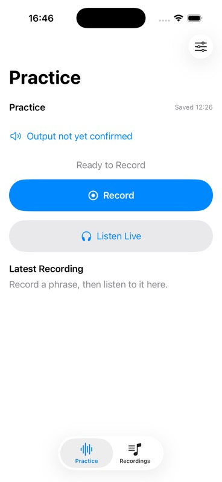
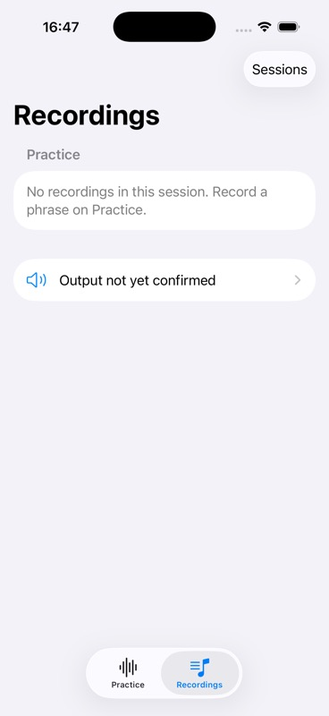
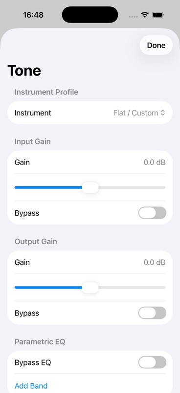

# F0.2 — Simplified Practice UI checkpoint

- Date: 5 October 2026 (America/Recife).
- Reviewed implementation: `96548e3a4461739c2d39f1d3705a65dd322e5c3a`.
- Branch: `codex/simplified-practice-ui`; PR stacks on `codex/session-library` / PR #22.
- Scheme: `BassPractice`.
- Validation method: XcodeBuildMCP, with host `simctl bootstatus -b` for boot readiness and `xcresulttool` for expanded test counts.
- DerivedData: `/tmp/BassySimplifiedUIValidation`.
- Simulator: iPhone 17 Pro, iOS 26.2; one simulator UDID retained throughout the checkpoint.
- Local signing/project changes and user files were preserved and excluded from the feature commits. Validation used that existing local project configuration.
- Xcode version: 26.2 (17C52).
- Simulator boot completion: confirmed by `bootstatus -b` after the full run shut down the base device.
- Screenshots match reviewed source: yes; production/test sources remained at `96548e3` throughout final validation.
- Hardware route: not physically validated.

## Scope demonstrated

Practice exposes Record, Finish Recording, Listen Live and the latest take. Recordings lists the current workspace's takes and opens session management separately. Tone opens from Practice; Audio Settings holds independent source volume/mute and input selection, with formats/meters behind Diagnostics.

New model tests cover one-action startup, denied permission, startup failure, playback exclusion during capture, conservative internal monitoring confirmation, headphone monitoring, restored monitoring disabled on startup, save failure/retry, stale save status and receiver/speaker labels. Existing session and native DSP/CAF suites remain part of the full run.

## Validation results

Xcode 26.2 (17C52). `test_sim` built and tested the frozen implementation through XcodeBuildMCP. No separate rebuild was performed for capture.

- Final focused run (`SimplifiedPracticeTests` + `SessionWorkspaceTests`): **13 logical / 15 expanded cases passed**, zero failures/skips, 168.1 s.
- Complete scheme: **138 logical / 258 expanded cases passed**, zero failures/skips, 233.6 s. Expanded counts were checked in `xcresulttool get test-results summary`.
- XcodeBuildMCP build/tests: pass. The full run includes native offline CAF playback, gain/EQ and session persistence tests.
- Full result: `/Users/dmh/Library/Developer/XcodeBuildMCP/workspaces/ios-bass-app-568e1d72ee9d/result-bundles/test_sim_2026-10-05T19-38-24-323Z_pid57734_cb4b1463.xcresult`.
- Full log: `/Users/dmh/Library/Developer/XcodeBuildMCP/workspaces/ios-bass-app-568e1d72ee9d/logs/test_sim_2026-10-05T19-38-24-323Z_pid57734_5a6bc93d.log`.
- Focused result: `/Users/dmh/Library/Developer/XcodeBuildMCP/workspaces/ios-bass-app-568e1d72ee9d/result-bundles/test_sim_2026-10-05T19-35-08-603Z_pid57734_2e087df4.xcresult`.

Recipes: configure project/scheme/simulator/DerivedData in session defaults; focused `test_sim` with `-quiet -only-testing:BassPracticeTests/SimplifiedPracticeTests -only-testing:BassPracticeTests/SessionWorkspaceTests`; final `test_sim` with `-quiet` only. An earlier development run passed 11 logical cases before two further regressions were added; its redundant typed-cast warning was removed before the final runs.

## Steps exercised and screenshots

The already-tested product was installed through MCP. Each destination was launched with `launch_app_sim({ launchArgs: ["-initial-tab", destination] })`. MCP screenshot capture succeeded for each state, the repository boot-screen checker accepted all three, and each image was visually inspected once. MCP returns optimized JPEG files; their actual format was preserved.

1.  — `session`: stopped engine, confirmed save timestamp and empty latest-take state. Record and Listen Live fit above the tab bar with no scroll. Output explicitly remains unconfirmed before activation.
2.  — `library`: current session's empty-take state, output/settings link and Sessions entry. No old session-list detour is required to view the current workspace.
3.  — `tone`: legacy launch argument opens Tone as a sheet over Practice; profile, gain and EQ remain accessible, with Done for returning.

The simulator's session contains no recorded takes. Active capture/playback, source-volume warning interaction, session opening by tap, input selection and Diagnostics navigation were not visually exercised. Their model behavior is covered where stated by tests; those tests do not validate native hit targets or audible hardware output.

## Known limits

No enabled tool in this session performs native iOS taps/swipes. Deterministic launch arguments exercise destination rendering; model tests exercise commands. This does not prove the complete native touch flow or an audible result.

Physical review is pending: built-in mic capture, speaker/receiver output, interface/headphones, latency/feedback, route changes, reopening saved recordings and Dynamic Type/VoiceOver with actual interaction. AVAudioSession category/mode/output policy was not changed. The prior report of inaudible playback remains unconfirmed; see the [controlled investigation](../../explorations/2026-10-05-navegacao-audio/PROPOSTA.md).

## Human decision requested

Review F0.2's navigation and transport behavior, then complete the physical checks before treating V0.1 as release-ready. Loop remains F9.1/V0.2.
