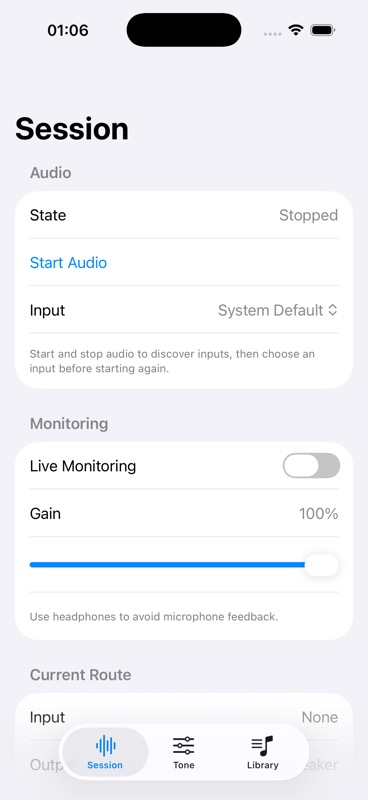

# F1.2.4 Audio Format Diagnostics checkpoint

- Date: 2026-10-05 (America/Recife)
- Reviewed app commit: `ebb7799509c57684cec7ee1313ee55e6132839ae`
- Branch: `task/F1-2-4-audio-format-diagnostics`
- Scheme: `BassPractice`
- Validation: XcodeBuildMCP focused tests, installation, launch and screenshot; direct host simulator boot completion check.
- Focused tests: 23 logical tests passed, 0 failed, 0 skipped; 138.1 seconds.
- Tested app: `/tmp/BassPracticeF12Validation/Build/Products/Debug-iphonesimulator/BassPractice.app`
- Destination: iPhone 17 Pro, iOS 26.2; one retained simulator.
- Full scheme: deferred to the completed F1.2.5 feature checkpoint.

## Evidence

The tested app was installed and launched with `-initial-tab session`. The screenshot gate accepted the capture and the coordinator visually inspected it: Session was stopped, input was System Default, monitoring was off with unity gain, and the visible form was readable. Lower diagnostics below the fold were not visually exercised. The screenshot demonstrates the initial controls, not live hardware diagnostics.

## Physical-device blocker and remaining review

The earlier `d237de0` checkpoint was not installed on Diego Phone. Developer Mode was enabled, but Developer Disk Image services remained unavailable; the project also lacked `DEVELOPMENT_TEAM`. No physical route or monitoring result is claimed.

Hardware review must still exercise start/stop, available-input selection including System Default, monitoring toggle/gain, actual routes and sample rate/channel/format/buffer diagnostics. Simulator evidence cannot establish Cube Baby behavior, microphone/output routing, latency, interruptions, reconnects or continuous physical monitoring. Recovery belongs to F1.2.5. Feature review and explicit merge authorization remain required.

Pre-existing `.gitignore.orig` and `README.md.orig` were left untouched.
