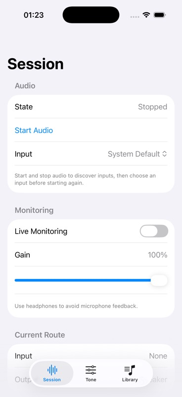

# F1.2 Audio Engine Core checkpoint

- Date: 2026-10-05 (America/Recife)
- Reviewed app commit: `2b8aacc7eae622aaa52341d88bf3950a02302f05`
- Source branch: `task/F1-2-5-interruption-recovery`
- Complete Feature PR: [#13](https://github.com/diegomhamilton/bassy-ios/pull/13), `codex/test-feature-f1-2-audio-engine-core`, based on F1.1 PR #6.
- Task stack: #7 → #8 → #9 → #10 → #12. Separate efficiency PR #11 is based on main and contains no app code.
- Authoritative validation: complete `BassPractice` scheme via XcodeBuildMCP, 62 logical / 98 expanded cases passed, 0 failed, 0 skipped, 106.2 seconds.
- Destination: one retained iPhone 17 Pro simulator, iOS 26.2; host `bootstatus` completed successfully in 20 seconds.
- DerivedData: `/tmp/BassPracticeF12Validation`.

## Evidence and limits

MCP installation, launch with `-initial-tab session`, and simulator opening succeeded using the validated app. Screenshot checker exited 0 and visual review confirmed readable initial Session controls: Stopped, System Default, monitoring off, gain 100%. Lower diagnostics below the fold were not exercised visually. No live hardware behavior is claimed.

The first test attempt at `f870f4a` failed compilation after 15.4 seconds and ran no tests; the final successful full scheme supersedes it. The earlier 46 logical focused tests passed in 168.4 seconds before the final stop repair, so they are supplemental evidence only.

The pre-edit `d237de0` checkpoint was not installed on Diego Phone: Developer Mode was enabled but Developer Disk Image services were unavailable, and `DEVELOPMENT_TEAM` was absent at that attempt. Those blockers were resolved during the final recheck using the user's local signing configuration. A Debug device build succeeded into `/tmp/BassPracticeFinalDevice`; `devicectl` installation and launch without the debugger succeeded on Diego Phone (iPhone Air, iOS 26.6.1), and BassPractice PID 3115 was confirmed active.

Installed source commit: `2b8aacc7eae622aaa52341d88bf3950a02302f05`, built with local uncommitted signing settings in `project.pbxproj`. That user-owned project modification remains unstaged. The initial CLI launch with `-initial-tab` arguments failed argument parsing; the default launch succeeded to Session, the default tab. The user reported debugger signal 9 around installation; its cause is unconfirmed, and the independent launch succeeded. Hardware audio review remains pending. Pre-existing `.gitignore.orig` and `README.md.orig` remain untouched.

## Combined F1.1/F1.2 hardware checklist

- [x] Configure signing and install the reviewed build; record device, OS and installed source commit (above). Record audio accessories during hardware review.
- [ ] Exercise microphone permission grant and denial, then start/stop with the built-in microphone.
- [ ] Connect USB/Cube Baby; inspect input/output routes and actual sample rate, channel counts, formats and IO buffer duration. Repeat with built-in input.
- [ ] Select an input by stable ID and System Default; verify selection and fallback across route changes.
- [ ] Enable monitoring and vary gain from 0 to 100%; verify audible response and silence after stop. Run continuous monitoring and record duration, route, dropouts and perceived latency.
- [ ] Interrupt a running session; resume only when the system permits and the session was previously running. Verify explicit stop during interruption prevents automatic resume.
- [ ] Background the app; verify stop/deactivation. Foreground it and verify reconciliation without automatic restart.
- [ ] Disconnect/reconnect the input and exercise explicit retry after failure; record state, route, diagnostics and recovery outcome.

Simulator tests cannot establish physical routing, Cube Baby compatibility, latency, interruption/reconnect behavior or continuous monitoring. Hardware and feature review remain pending; no merge is authorized.
