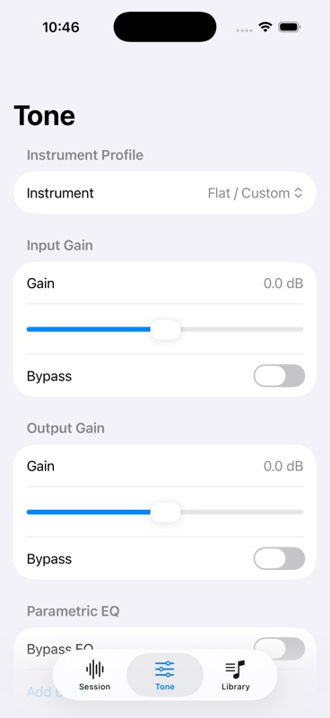

# Live instrument profiles and parametric EQ

Reviewed source `8d859c7`, branch `codex/parametric-eq-profiles`, based on gain PR #17. Local signing/project formatting and `.orig` files remain excluded.

The instrument graph now runs Input → Gain → Parametric EQ → Instrument Mixer → Main Mixer → Output Gain. Up to eight bands can change without graph rebuilds. All bands use native parametric filtering; Q converts to the SDK's octave bandwidth. Native bounds are checked before any gain/EQ writes, including current sample-rate Nyquist. Unused bands are bypassed when switching to fewer bands or Flat.

Session and Tone expose Bass/Guitar/Flat/custom selection. Tone supports band frequency/gain/Q/enable, global EQ bypass, and custom tone save/delete. Saving uses one actor snapshot; a bypassed input gain is saved as effective unity gain. Stored legacy EQ values without a bypass field remain compatible. Storage errors are surfaced while built-ins remain available.

Focused XcodeBuildMCP suites passed 23 logical tests, zero failures/skips, 188.1 seconds. The first compile attempt ran no tests because one fixture-parameter test needed fileprivate visibility; that was corrected before the successful run. Coverage includes rejected native values, failure retention, graph rebuild, custom save/reopen/select/delete and legacy decoding.

Complete XcodeBuildMCP scheme at this source passed **96 logical /203 expanded cases**, zero failures/skips, 177.7 seconds, on the retained iPhone 17 Pro simulator (iOS 26.2, `34AA36AD-2704-4759-A347-01A023DEB371`). DerivedData `/tmp/BassPracticeF12Validation`. Native offline rendering measures +6/−6 dB center-frequency amplitude, disabled-band/global bypass and removal of an earlier boosted band on Flat.

Result: `/Users/dmh/Library/Developer/XcodeBuildMCP/workspaces/ios-bass-app-791fac75e19c/result-bundles/test_sim_2026-10-05T13-41-51-494Z_pid30850_a63daeff.xcresult`.

The already-tested app installed/launched via MCP after confirmed simulator boot. Screenshot checker accepted the capture; visual review confirms readable profile selector and gain controls. EQ/custom-editor controls below the fold and interactive gestures were not exercised visually.

Physical listening, actual interface routes, latency and uninterrupted profile changes remain human hardware gates. Recording/playback implementation follows this checkpoint; V0.1 is not complete.
