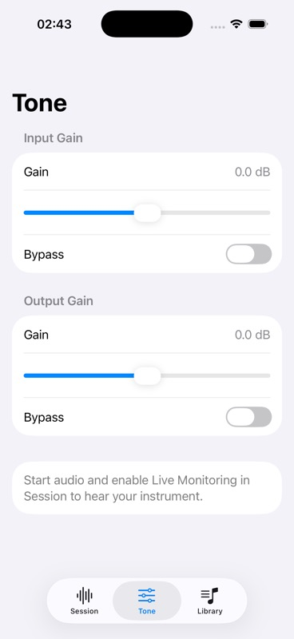

# Profiles foundation and gain checkpoint

- Date: 2026-10-05, America/Recife.
- Reviewed source: `ce63bc2`, branch `codex/gain-processing`.
- F2.1 foundation: validated domain and stable neutral built-ins, plus serialized atomic custom-profile storage. Profile selector and immediate gain/EQ application remain pending; F2.1 is incomplete.
- F3.1: zero-band native AVAudioUnitEQ stages before the instrument mixer and after the main mixer. Finite values in the native −96…+24 dB range; UI exposes −24…+24 dB. Gain changes commit after backend success and survive graph rebuilds. Monitoring remains independent. Bypass preserves each requested gain.
- Recording and recorded-audio playback remain unimplemented.

## Validation

XcodeBuildMCP focused repository suite: 8 logical /16 expanded cases passed, zero failures/skips, 120.9 seconds. Covers CRUD, reopen, duplicate/reserved IDs, invalid/unsupported stores, exact-byte preservation, serialized concurrent writes and failed atomic-write retry.

XcodeBuildMCP focused gain/native/dependency suites: 9 logical /22 expanded cases passed, zero failures/skips, 109.7 seconds. Includes seven bounded offline-render amplitude cases using production gain adapters: unity, input/output −6 dB, combined −12 dB and independent bypass. This establishes numeric software DSP behavior, not physical routing or latency.

Final complete scheme at `ce63bc2`: **87 logical /183 expanded cases passed**, zero failures/skips, 106.4 seconds. DerivedData `/tmp/BassPracticeF12Validation`; iPhone 17 Pro simulator, iOS 26.2, retained UDID `34AA36AD-2704-4759-A347-01A023DEB371`.

Result bundle: `/Users/dmh/Library/Developer/XcodeBuildMCP/workspaces/ios-bass-app-791fac75e19c/result-bundles/test_sim_2026-10-05T05-40-57-746Z_pid30850_e38d883c.xcresult`.

After confirmed boot completion, the already-tested app installed and launched through MCP with `-initial-tab tone`. Screenshot checker accepted the image; visual inspection confirmed readable input/output values, sliders, bypass and Session listening instructions. Slider gestures were not exercised automatically.

Device build and `devicectl` installation succeeded on Diego Phone (iPhone Air, iOS 26.6.1), using the user's uncommitted signing settings in `project.pbxproj`; those settings and pre-existing `.orig` files are excluded from commits. Xcode emitted credential warnings for two stored accounts and an interface-orientation warning, but the build completed successfully. Automatic launch was denied because the device was locked (CoreDevice 10002 / FBSOpenApplicationErrorDomain 7). No successful launch or listening result for this source is claimed; unlock the phone and open the installed app manually.

## Pending review

Listen on Diego Phone with the actual instrument/interface and output route. Start audio and enable Live Monitoring in Session, then exercise both gains and bypass in Tone. Confirm audible changes, monitoring silence, interruption/route recovery and continuous operation. No hardware listening result is claimed.

F2.1.1 and F2.1.2 draft PRs #14/#15 passed CI. Automatic approval review initially rejected F2.1.3 draft PR creation for lack of explicit destination authorization. The user subsequently authorized filing PRs: persistence [#16](https://github.com/diegomhamilton/bassy-ios/pull/16) and gain [#17](https://github.com/diegomhamilton/bassy-ios/pull/17) were created and both passed CI. No merges performed.
