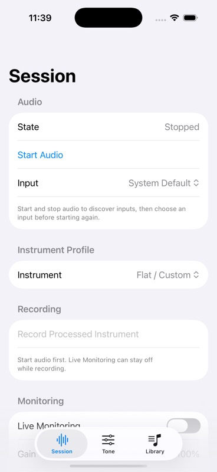

# Processed recording and playback checkpoint

Reviewed source `81c4ac3`, branch `codex/recording-playback`, based on effect-chain PR #19. User-owned signing/project formatting, test signing changes, untracked BassPracticeTests.xcscheme and .orig files remain untouched and excluded.

## Behavior

The processed-instrument mixer supplies a tap before monitoring gain/mute. CAF stores lossless Float32 audio at the captured format. A synchronized sink closes the file before publishing frame count/duration and rejects late callbacks. Existing files are not overwritten; creation, format/write and empty-capture failures are visible. Stop, route rebuild, background and interruption finalize capture before stopping the engine.

Session exposes Record/Stop, current-process recording rows, Play and Stop Playback. Playback uses a separate player/mixer into the main mixer and output gain, bypassing instrument gain/EQ and monitor mute. Completion generations prevent an old callback from stopping a replay of the same recording. Output-stage connections explicitly use the hardware/manual-render channel format; playback preserves the file format until the main mixer performs hardware conversion.

CAF paths use Application Support/Bassy/Sessions/<session-id>/recordings/<recording-id>.caf. No temporary production fallback. **The recording list is still in memory; F7 metadata/library persistence is required to reopen recordings after relaunch. V0.1 is not complete.** Independent playback mix controls and meters are F6 follow-up work.

## Evidence

Initial focused recording/lifecycle/recovery suites passed 44 logical tests. Expanded native playback coverage exposed a √0.5 attenuation for mono output due to an intermediate stereo format. Correcting playback-mixer format alone did not resolve it; explicitly setting both output-gain connections to the output format did. The original −6 dB amplitude assertion was retained. An individual-method filter executed zero tests and was discarded.

Final focused RecordingPlaybackTests passed **9 logical /10 expanded cases**, zero failures/skips, 220.1 seconds. It verifies mono/stereo CAF sample roundtrip, late-buffer rejection, preserved existing files, write failure, engine/interruption finalization, lifecycle guards, stale completion and playback errors. Native offline rendering reads the CAF through the production playback/mixer/output path and measures the expected −6 dB amplitude.

Full XcodeBuildMCP scheme at `81c4ac3` passed **109 logical /220 expanded cases**, zero failures/skips, 210.1 seconds. Retained iPhone 17 Pro simulator, iOS 26.2, `34AA36AD-2704-4759-A347-01A023DEB371`; DerivedData `/tmp/BassPracticeF12Validation`.

Result: `/Users/dmh/Library/Developer/XcodeBuildMCP/workspaces/ios-bass-app-791fac75e19c/result-bundles/test_sim_2026-10-05T14-31-41-798Z_pid30850_78ec70fa.xcresult`.

After confirmed boot, MCP installed/launched the already-tested app with `-initial-tab session`. Screenshot checker accepted the capture. Visual review confirmed readable stopped state, profile selector, disabled Record button and start-audio instruction. Active recording/playback and controls below the fold were not visually exercised.

Device Debug build succeeded with the user's local signing, with the pre-existing orientation warning. `devicectl` installed source `81c4ac3` on Diego Phone (previously identified iPhone Air, iOS 26.6.1). Automatic launch was denied because the phone was locked (CoreDevice 10002 / FBS error 7). Unlock and open the installed app manually. No device capture/playback result is claimed.

## Hardware review

Use built-in input and Cube Baby with the intended output route. Start Audio, select a tone, record with Live Monitoring both off and on, stop and play. Verify tone is recorded once, mute/output gain do not change captured levels, expected channel/sample format, usable duration and continuous operation. Exercise stop/background/interruption/route rebuild during capture and playback; inspect the finished file and retry behavior. Measure latency and check glitches before approving V0.1.
