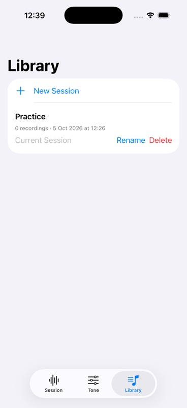
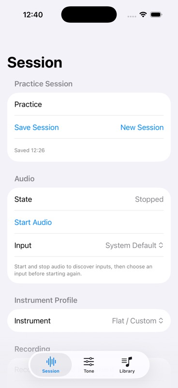

# Session Library / V0.1 software checkpoint

Reviewed source `3d7319a`, branch `codex/session-library`, based on mixer PR #21. All PRs filed in this checkpoint remain drafts and unmerged.

One shared workspace now saves/reopens input/output gain and bypass, EQ bands/bypass, profile/preset references, independent mixer volumes/mutes, recording IDs and audio format/frame metadata. Versioned JSON is written atomically alongside CAF files. Recording URLs are reconstructed under the current app storage root, so an app container relocation does not preserve stale absolute paths. Renaming leaves audio bytes untouched. Deletion affects the selected session directory only and asks for confirmation in the UI.

The initial session is restored with the audio engine stopped. Opening another session flushes the current snapshot and restores all audio state together; invalid settings or native backend rejection leave the committed settings intact. Tone is recreated for the opened session. Debounced autosave covers successful tone, mixer and media changes; background entry explicitly saves. Saving errors remain visible. Blank draft names use the previous valid name during autosave so audio metadata remains saved. Corrupt/future metadata is preserved rather than overwritten.

Earlier F4 recording folders are upgraded by reading valid CAF headers. Incomplete files stay in place with a notice. The original tone was not stored by those earlier builds and cannot be recovered. Missing or unreadable recordings remain a playback error; this checkpoint does not fabricate recordings or silently discard failed metadata.

Focused XcodeBuildMCP results: repository/dependencies 8 logical tests, zero failures/skips (114.6s); workspace model 3 logical tests, zero failures/skips (103.0s); final atomic-restore/model suites 7 logical tests, zero failures/skips (101.4s). Cases cover container relocation, audio-byte preservation on rename, sibling-safe deletion, corrupt/future-store preservation, legacy recovery, session switching without automatic audio start, debounced name saving using continuations, and full snapshot retention on rejected restoration. Final complete-scheme evidence follows below.

Retained iPhone 17 Pro simulator, iOS 26.2, UDID `34AA36AD-2704-4759-A347-01A023DEB371`; DerivedData `/tmp/BassPracticeF12Validation`. User-owned signing/project changes, test scheme and `.orig` files are excluded from the PR.

The first complete run at `5637e8b` passed 126 logical /244 expanded cases, zero failures/skips, 95.9s. Visual inspection then found an initial-load race: Library could read before workspace preparation created its first session and remain empty. `597bdd4` keys the reload task to the saved workspace date and discards cancelled reload results. A fresh complete run and refreshed screenshots validate that final source below.

Complete XcodeBuildMCP scheme after the Library refresh repair at `597bdd4`: **126 logical /244 expanded cases**, zero failures/skips, 97.6s. Result `/Users/dmh/Library/Developer/XcodeBuildMCP/workspaces/ios-bass-app-791fac75e19c/result-bundles/test_sim_2026-10-05T15-27-43-485Z_pid30850_847489ba.xcresult`. Native offline gain/EQ and CAF playback tests are included; no production source changed during the run.

`fa6575d` makes Save/New Session independently tappable inside Form; its complete scheme passed 126 logical tests, zero failures/skips. Final source `3d7319a` also rejects cancelled saves and remembers deleted IDs within the repository actor, preventing a delayed actor job from recreating a removed directory. Focused repository tests passed **7 logical tests**, zero failures/skips, 92.6s, including explicit late-save and cancellation cases. These new tests use a self-cancelled task and direct operations, with no timing sleeps.

**Final complete XcodeBuildMCP scheme at `3d7319a`: 128 logical /246 expanded cases, zero failures/skips, 89.7s.** Result `/Users/dmh/Library/Developer/XcodeBuildMCP/workspaces/ios-bass-app-791fac75e19c/result-bundles/test_sim_2026-10-05T15-36-41-396Z_pid30850_05f599f1.xcresult`. Production sources were frozen during validation. The same source passed the signed device build with only the existing orientation warning.

Device: Diego Phone, CoreDevice `A3D08828-4222-567C-8360-F94803FE37F0`, DerivedData `/tmp/BassPracticeFinalDevice`. Build/install/launch succeeded at `5637e8b`. The `597bdd4` build and install succeeded, but launch was denied because the device had locked again (CoreDevice 10002 / FBS error 7, Locked). Launch workflow stopped there; a later final-source installation is recorded below. Audible output and recovered device recordings have not been observed by this agent.

Final source `3d7319a` was installed successfully on Diego Phone at 12:39 local time. The locked-device launch was not repeatedly retried; unlock and open the installed app manually for the physical review.

Simulator review uses the already-tested app output, after base-device boot completion, installation and deterministic Library/Session launches. Accepted screenshots passed the boot-screen checker and were visually inspected. Library shows the saved Practice session, date, recording count, rename/delete controls and current-session status. This simulator session has no recordings; screenshots do not claim device capture or playback. Interactive open/rename/delete and below-fold audio controls remain manual review gates.

Physical gates remain: built-in microphone and Cube Baby capture, wired/USB playback, audible gain/EQ changes, monitor mute independent of recorded levels, source balance/meter response, latency/glitches and interruption/route recovery. Simulator/native CAF tests do not prove audible playback on the connected iPhone. No merges or release publication are authorized by this checkpoint.

The stack filed during this task: [#16 persistence](https://github.com/diegomhamilton/bassy-ios/pull/16), [#17 gain](https://github.com/diegomhamilton/bassy-ios/pull/17), [#18 live profiles/EQ](https://github.com/diegomhamilton/bassy-ios/pull/18), [#19 ordered chain](https://github.com/diegomhamilton/bassy-ios/pull/19), [#20 recording/playback](https://github.com/diegomhamilton/bassy-ios/pull/20), [#21 source mixer](https://github.com/diegomhamilton/bassy-ios/pull/21). All have passing CI; #18 required one successful rerun after an initial failure with unavailable diagnostic evidence. No specific cause is asserted for that first failure.

## Remote CI follow-up

[PR #22](https://github.com/diegomhamilton/bassy-ios/pull/22) initially used the inherited workflow's default Xcode 16.4 and `OS:latest` destination. [Attempt 1](https://github.com/diegomhamilton/bassy-ios/actions/runs/37335116839/attempts/1) compiled but reported failures across existing/native and new suites without assertion/crash details; no xcresult artifact was uploaded. Its cause remains unconfirmed. A single same-head rerun [failed before testing](https://github.com/diegomhamilton/bassy-ios/actions/runs/37335116839/attempts/2): no iOS simulator destination was available. This is a distinct, confirmed runner setup failure.

The workflow now explicitly selects Xcode 26.2, creates and waits for an iOS 26.2 simulator, tests by UDID, and uploads the result bundle, simulator inventory and build log even on failure. This matches the versions documented for the actual [runner image](https://github.com/actions/runner-images/blob/macos-15-arm64/20260907.0337/images/macos/macos-15-arm64-Readme.md); artifact configuration follows [the official upload action](https://github.com/actions/upload-artifact). App/test sources remain at reviewed source `3d7319a`; this follow-up changes CI configuration and evidence only. The new run is required before claiming remote CI approval.
